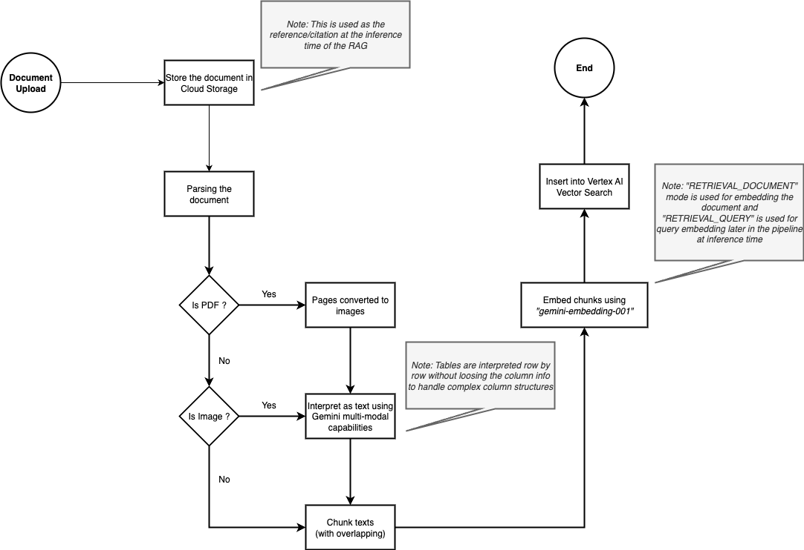
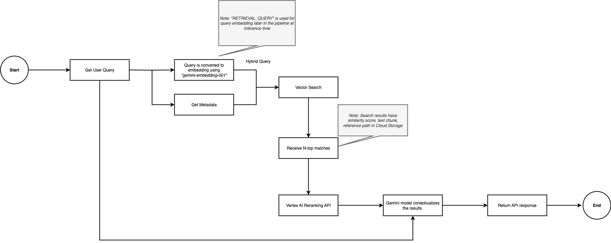

# Cymbal RAG API

A comprehensive RAG (Retrieval-Augmented Generation) API built with FastAPI and Google Cloud services, leveraging Vertex AI Vector Search for semantic document retrieval and Google Gemini for response generation.

## Background

This system is designed to provide intelligent document search and question-answering capabilities by combining:

- **Vertex AI Vector Search**: For semantic similarity search across document embeddings
- **Google Cloud Storage**: For secure document storage and management
- **Google Gemini**: For advanced text generation and document processing
- **Discovery Engine Reranking**: For improved search result relevance
- **FastAPI**: For high-performance REST API endpoints

The system supports complete document lifecycle management including upload, processing, embedding, search, and re-embedding capabilities.

## RAG Embedding Flow

The document ingestion and embedding process follows a structured pipeline:



This diagram shows how documents are processed, chunked, and embedded into the vector database for later retrieval.

## RAG Inference Flow

The search and response generation process uses the embedded vectors to provide intelligent answers:



This diagram illustrates how user queries are processed through vector search, reranking, and response generation.

## Key Features

- **Complete API-based System**: All functionality accessible through REST endpoints
- **Document Processing**: Support for PDF, images, Excel, CSV, and text documents
- **Multimodal Processing**: Uses Gemini for PDF-to-image conversion and content extraction
- **Vector Search**: Semantic search using Vertex AI Vector Search with configurable similarity thresholds
- **Reranking**: Google Discovery Engine integration for improved search result relevance
- **Re-embedding**: Automatic re-embedding when documents are updated or replaced
- **File Tagging**: Organize documents with custom tags for better filtering
- **Authentication**: Token-based API security
- **Comprehensive Testing**: Automated testing with performance evaluation and visualization

## API Endpoints

### File Management
- `POST /api/v1/file/validate` - Validate file before upload
- `POST /api/v1/upload/direct` - Upload file directly to knowledge base
- `POST /api/v1/upload/{validation_id}` - Upload file using validation ID
- `GET /api/v1/files/list` - List uploaded files with filtering and pagination
- `GET /api/v1/files/view` - Download/view a specific file
- `GET /api/v1/files/embedding-stats` - Get embedding statistics for a file
- `DELETE /api/v1/upload/delete` - Delete a file from knowledge base

### Search
- `POST /api/v1/search/rag` - RAG search with vector similarity and reranking

### System
- `GET /health` - Health check endpoint
- `GET /api/v1/file/supported-formats` - Get supported file formats

### Postman Collection
A complete Postman collection is provided (`postman_collection.json`) with all API endpoints pre-configured for easy testing and integration.

## Quick Setup

### Prerequisites
- Python 3.11+
- Conda (for environment management)
- Google Cloud Platform account with Vertex AI and Cloud Storage enabled
- poppler-utils (for PDF processing)

### 1. Clone and Setup Environment

```bash
# Clone the repository
git clone <repository-url>
cd cymbal-rag

# Run the automated setup script
./setup.sh
```

The setup script will:
- Detect your operating system
- Install poppler (required for PDF processing)
- Create conda environment
- Install all Python dependencies
- Create .env file from template

### 2. Configure Google Cloud

```bash
# Copy your service account key
cp /path/to/your/service-account-key.json ./service-account-key.json

# Edit .env file with your GCP configuration
nano .env
```

Required .env configuration:
```bash
GOOGLE_CLOUD_PROJECT_ID=your-project-id
GOOGLE_APPLICATION_CREDENTIALS=service-account-key.json
VERTEX_AI_LOCATION=us-central1
VECTOR_SEARCH_INDEX_ID=your-index-id
VECTOR_SEARCH_INDEX_ENDPOINT_ID=your-endpoint-id
VECTOR_SEARCH_DEPLOYED_INDEX_ID=your-deployed-index-id
STORAGE_BUCKET_NAME=your-bucket-name
API_AUTH_TOKEN=your-secure-token
```

### 3. Start the API

```bash
# Start in production mode (default: port 8000, 4 workers)
./run.sh start

# Start in development mode with auto-reload
./run.sh start 8000 1 dev

# Check server status
./run.sh status

# View logs
./run.sh logs

# Stop server
./stop.sh
```

### 4. Test the API

```bash
# Quick API test
python scripts/quick_api_test.py

# Or use the Postman collection
# Import postman_collection.json into Postman
```

## Testing Framework

The system includes a comprehensive testing framework that evaluates vector search performance:

### Performance Evaluation

```bash
# Run vector search evaluation
python scripts/test_vector_search_evaluation.py
```

This script:
- Uploads test documents to the knowledge base
- Tests with related and unrelated queries
- Measures similarity scores and response times
- Generates performance graphs and statistics
- Saves results to `test_results/` directory

### Test Results

Results are automatically saved to the `test_results/` directory including:
- `vector_search_evaluation_results.json` - Detailed performance metrics
- `distance_distribution.png` - Visualization of similarity score distributions
- `performance_summary.txt` - Summary of test results

### Unit Tests

```bash
# Run all tests
pytest

# Run with coverage
pytest --cov=app --cov-report=html

# Run specific test categories
pytest tests/unit/
pytest tests/integration/
```

## Document Processing

The system supports comprehensive document processing:

### Supported Formats
- **PDF**: Converted to images for Gemini processing
- **Images**: PNG, JPEG with OCR text extraction
- **Spreadsheets**: Excel (XLSX, XLS) and CSV files
- **Text**: Plain text and Word documents

### Processing Features
- **Empty Page Detection**: Automatically skips empty pages
- **Table Extraction**: Converts tables to structured bullet points
- **Multimodal Analysis**: Uses Gemini for content understanding
- **Chunking**: Intelligent text chunking with configurable parameters
- **Re-embedding**: Automatic re-embedding when documents are updated

## Configuration

### RAG Configuration (config/config.json)
```json
{
  "chunk_size": 1000,
  "chunk_overlap": 200,
  "max_chunks_per_document": 50,
  "similarity_threshold": 0.7,
  "max_results": 10
}
```

### Environment Variables
See `.env-template` for complete configuration options.